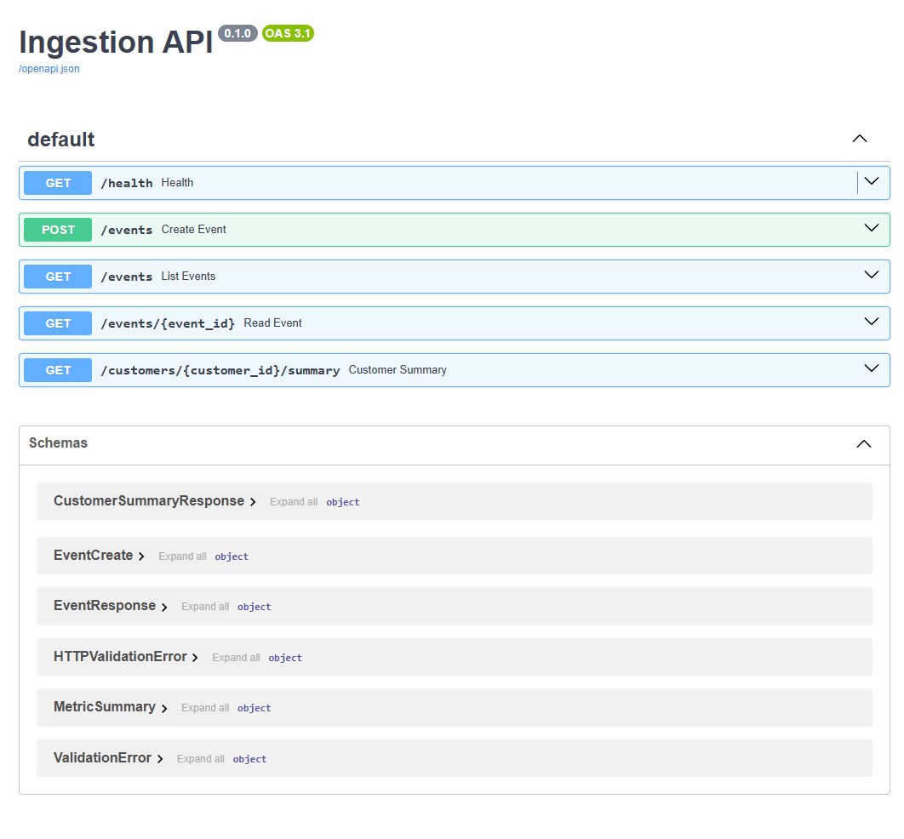

# Ingestion API

A FastAPI REST API for data ingestion and processing.

This project separates the application into **models**, **repository**, **service**, and **route** layers:

* **Models** handle request validation and response shapes.
* **Repository** owns storage and filtering.
* **Service** owns business logic, such as summary aggregation.
* **Routes** stay thin and handle HTTP concerns.

The app currently uses **in-memory storage**, but it can be easily swapped with a database by updating the repository layer without changing the rest of the application.



## Live Demo

* Backend: https://telemetry-ingestion-api.onrender.com/docs

## Quick Start

Quick reference for running the app locally and running the test suite.

## Prerequisites

* Python 3.10+
* Git
* Recommended: virtual environment

## Setup

Create and activate a virtual environment.

### macOS / Linux

```bash
python -m venv .venv
source .venv/bin/activate
```

### Windows Command Prompt

```cmd
python -m venv .venv
.venv\Scripts\activate
```

### Windows PowerShell

```powershell
python -m venv .venv
.venv\Scripts\Activate.ps1
```

## Install Dependencies

If you have a `requirements.txt` file:

```bash
pip install -r requirements.txt
```

Otherwise, install the essentials:

```bash
pip install fastapi uvicorn pydantic pytest httpx
```

Optional: install the package in editable mode so imports work everywhere:

```bash
pip install -e .
```

## Run the Application

From the project root, which is the directory that contains `app/` and `tests/`, run:

```bash
uvicorn app.main:app --reload
```

The API will be available at:

```txt
http://127.0.0.1:8000
```

Interactive Swagger docs:

```txt
http://127.0.0.1:8000/docs
```

## Example Requests

### Health Check

```bash
curl http://127.0.0.1:8000/health
```

### Create Event

```bash
curl -X POST http://127.0.0.1:8000/events \
  -H "Content-Type: application/json" \
  -d '{"customer_id":"alice","resource_id":"r1","metric_name":"cpu","value":12.5}'
```

### Get Event

```bash
curl http://127.0.0.1:8000/events/<event_id>
```

### Customer Summary

```bash
curl http://127.0.0.1:8000/customers/<customer_id>/summary
```

## Run Tests

From the project root, make sure your virtual environment is activated, then run:

```bash
python -m pytest -q
```

Or:

```bash
pytest -q
```

## Troubleshooting

If tests fail with:

```txt
ModuleNotFoundError: No module named 'app'
```

Try the following:

1. Make sure you are running tests from the project root.
2. Make sure `app/__init__.py` exists.
3. Install the project in editable mode:

```bash
pip install -e .
```

## Notes

* Tests use FastAPI's `TestClient` and the in-memory repository.
* The test fixture resets the repository for each test, so tests are isolated.
* The in-memory repository is single-process only.
* For production use, replace the in-memory repository with a persistent store such as PostgreSQL, MySQL, Cosmos DB, or Redis.
* Keep the server process running for local manual testing.
* Stop the server with `Ctrl+C`.
